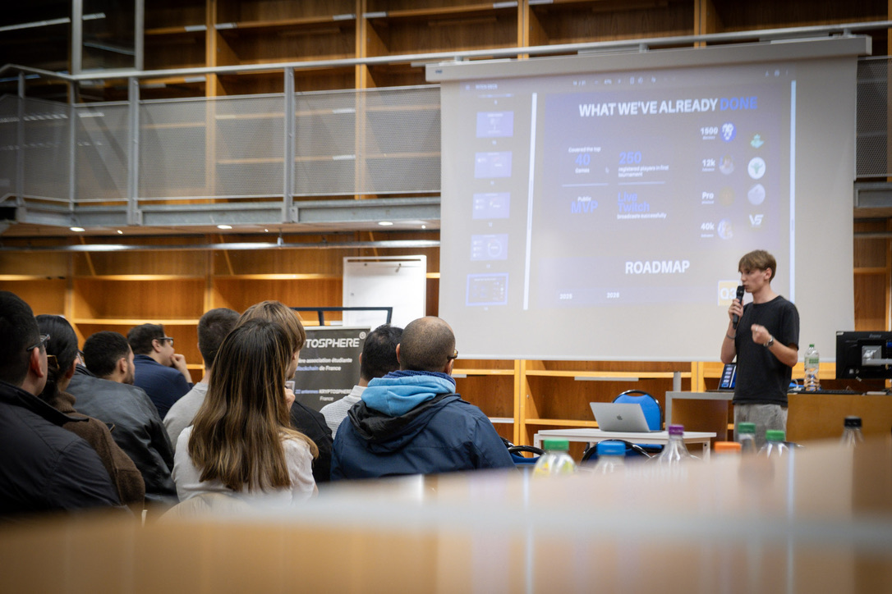

<br/>

<h3 align="center">Web3 Developer · Systems Programmer · Builder</h3>

<p align="center">
  <b>Available for work</b>
</p>

<p align="center">
  <code>Rust</code> · <code>TypeScript</code> · <code>C</code> · <code>C++</code> · <code>Solana</code> · <code>Anchor</code>
</p>

---

### About

Web3 believer building on-chain. I write systems-level code, ship full-stack dApps, and I can pitch what I build.

42 school trained | low-level foundations, peer-to-peer learning, zero hand-holding.

[](https://github.com/8-1000-e)

---

### Experience

| | |
|---|---|
| **Colosseum Cypherpunk** | Top 15 french project |
| **Solana Breakpoint 2025** | Invited by Solana Foundation — Abu Dhabi |
| **mtnDAO 2026-1** | Attended |

---

### Stack

```
Backend     Rust · TypeScript · Node.js
Systems     C · C++
Blockchain  Solana · Anchor · SPL
Frontend    React · Next.js
```

---

<p align="center">
  <a href="https://github.com/8-1000-e">
    
  </a>
</p>

<p align="center">
  <i>"Don't trust, verify."</i>
</p>
